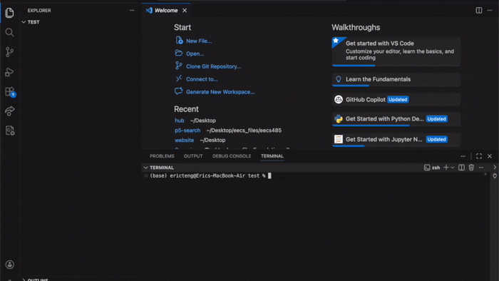
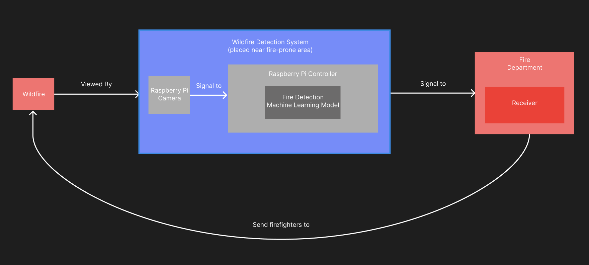
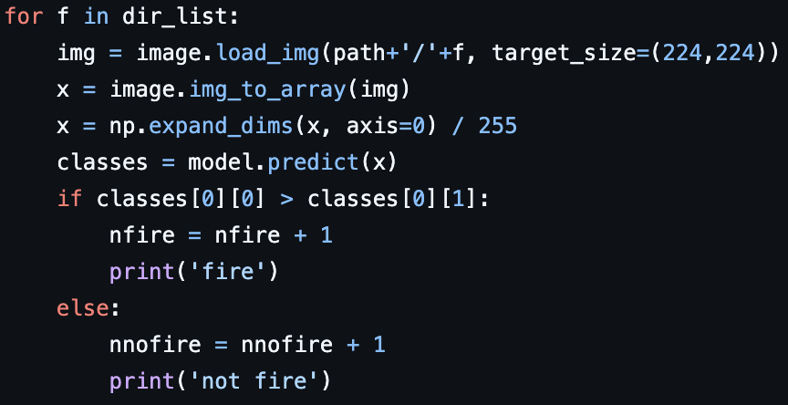

# Tensorflow Wildfire Detection System


## Description

This project is a program that trains two different machine learning models to identify images on a camera feed. These models classify images based on whether or not the image has a fire in it.

This project is for enabling a wildfire detection system to detect wildfires early so that firefighters can put out fires quicker. The goal is to decrease the latency between the fire starting and the firefighters arriving, hopefully mitigating the size of the wildfire.

## Table of Contents
* [Description](#description)
* [Quickstart & Installation](#quickstart--installation)
* [Main Feature Overview](#main-feature-overview)
* [Architecture Diagram](#architecture-diagram)
* [Usage Examples](#usage-examples)
* [Frequently Asked Questions](#frequently-asked-questions)

## Quickstart & Installation
### Prerequisites
* Python 3.9+
* Tensorflow
* OpenCV
* NumPy
* Keras

### Installation
1. Install a Python Environemnt
  ```bash
  sudo apt update
  sudo apt install python3 python3-pip python3-venv -y
  python3 -m venv my_env
  source my_env/bin_activate
  ```
2. Install the libraries
  ```bash
  pip install --upgrade pip
  pip install numpy tensorflow opencv-python keras
  ```
3. Clone the repo:
  ```bash
  git clone https://github.com/eteng2012/Wildfire-Detector
  ```

Gif Example of how to clone Github Repo:



## Main Feature Overview

The main feature of this project is a image detection machine learning model that can identify wildfires within images. This project has 2 different models split across 2 different Python files, each with varying accuracy. It also includes a test file to measure accuracy, the InceptionV3 model having around 95% accuracy.

The first python file, fire_detect_handmade_model.py, is a program that trains a model with layers set by hand. The second python file, fire_detect_inceptionV3_model.py, is a program that trains a model using a combination of both the InceptionV3 model and my own model layers for formatting and further accuracy.

The input images from the camera feed are fed into these models, which then output an 01 classification (yes or no if there is a fire in the image).

## Architecture Diagram

Below is an architecture diagram of how this project will be used in practice.



## Usage Examples

To use this project, use the saved machine learning models and call them in a Python script connected to a Raspberry Pi using model.predict (must be programmed separately). An example of how to do this is in the fire_detect_model_test.py. Screenshot below:



To do custom retraining of the models, modify and rerun fire_detect_inceptionV3_model.py and fire_detect_handmade_model.py. Then, you can run fire_detect_model_test.py on a personal dataset to check accuracy.

Gif example of where to find fire datasets:


## Frequently Asked Questions

**Can this project be used to detect different things other than fires?**

Yes, this project can be used to detect any object in an image. To change the object from fires to a different object, you just need to download a dataset for that object and rerun the model training scripts.

**Can I use a base model other than InceptionV3?**

Yes, this project is flexible to other base models, but it could be harder to use as InceptionV3 is included in the Keras package, while other models might require more imports and dependencies to get working.
